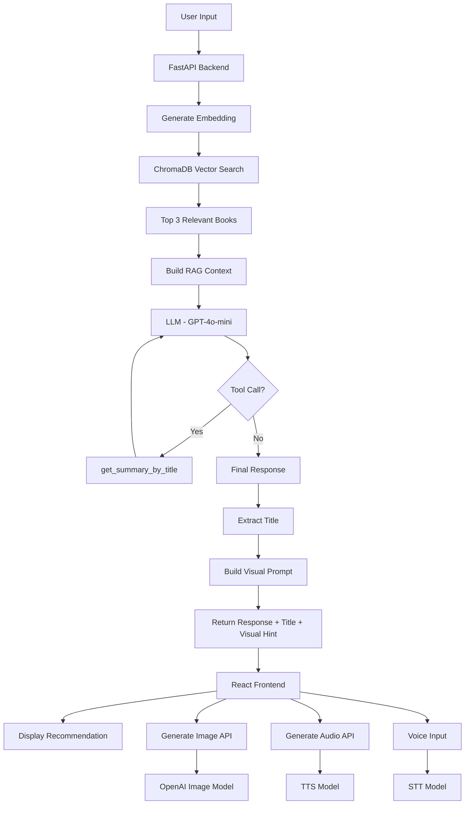

#  Smart Librarian

## Descriere proiect

**Smart Librarian** este o aplicație AI care recomandă cărți pe baza preferințelor utilizatorului, folosind un sistem de **RAG (Retrieval-Augmented Generation)** combinat cu **Tool Calling**.

Aplicația permite utilizatorului să:

* descrie ce tip de carte caută (ex: „prietenie și magie”)
* primească o recomandare relevantă dintr-o bază de date locală
* obțină un rezumat complet printr-un tool dedicat
* genereze o ilustrație inspirată din carte
* asculte răspunsul (TTS) sau să interacționeze vocal (STT)

---

##  Arhitectură (Flow complet)



---

##  Tehnologii utilizate

### Backend

* FastAPI (Python)
* OpenAI API (GPT-4o-mini, embeddings, TTS, STT, image generation)
* ChromaDB (Vector Store)

### Frontend

* React (Vite)
* CSS custom (design editorial)

---

##  Instalare și rulare

### 1. Clonează proiectul

```bash
git clone <repo-url>
cd smart-librarian
```

---

### 2. Creează environment și instalează dependințe

```bash
python -m venv venv
source venv/bin/activate   # Mac/Linux
venv\\Scripts\\activate      # Windows

pip install -r requirements.txt
```

---

### 3. Setează variabilele de mediu

Creează fișier `.env`:

```env
OPENAI_API_KEY=your_api_key_here
```

---

### 4. Build Vector Store (IMPORTANT)

```bash
python build_vector_store.py
```

---

### 5. Pornește backend-ul

```bash
uvicorn main:app --reload
```

Backend-ul rulează pe:

```
http://127.0.0.1:8000
```

---

### 6. Pornește frontend-ul

```bash
cd frontend
npm install
npm run dev
```

Frontend:

```
http://localhost:5173
```

---

##  Exemple de întrebări pentru testare

### 🔹 General

* „Vreau o carte despre prietenie și magie”
* „Ce recomanzi pentru cineva care iubește aventurile fantastice?”
* „Vreau o carte despre libertate și control social”

### 🔹 Specific

* „Ce este 1984?”
* „Recomandă-mi ceva despre dezvoltare personală”
* „O carte despre sensul vieții”

### 🔹 Edge cases

* „Vreau ceva foarte emoțional”
* „Recomandă-mi o carte similară cu Dune”

---

##  Funcționalități principale

* RAG semantic search (ChromaDB + embeddings)
* Recomandare inteligentă de carte
* Tool calling (`get_summary_by_title`)
* Generare ilustrație AI
* Text-to-Speech (TTS)
* Speech-to-Text (STT)
* Filtru limbaj ofensator

---

##  Cum funcționează RAG (în 5 fraze simple)

1. Utilizatorul introduce o întrebare sau o preferință.
2. Textul este transformat într-un embedding (vector numeric).
3. Vectorul este comparat cu cele din ChromaDB pentru a găsi cărțile relevante.
4. Se construiește un context cu aceste rezultate și se trimite la model.
5. Modelul alege cea mai potrivită carte și generează răspunsul final.

---

##  Securitate

* Cheia OpenAI este stocată în `.env`
* Fișierul `.env` este ignorat prin `.gitignore`
* Vector store-ul local (`chroma_db/`) nu este inclus în repository

---

##  Observații finale

Acest proiect demonstrează integrarea unui sistem RAG complet într-o aplicație reală, combinând:

* retrieval semantic
* generare LLM
* tool calling
* interfață modernă

Este extensibil și poate fi îmbunătățit cu:

* mai multe cărți
* fine-tuning prompturi
* deploy în cloud
